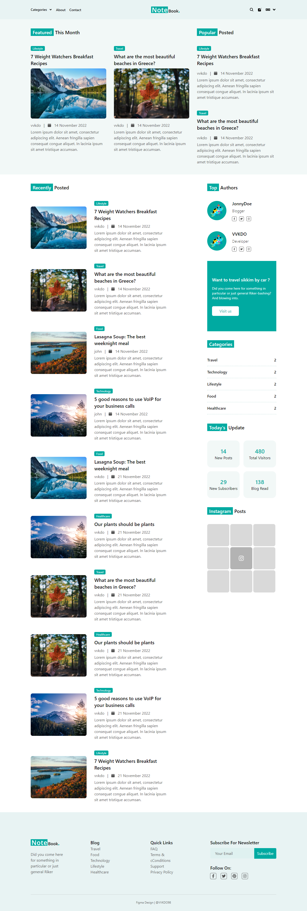

# React Blog With Api Blog

## To do

- [x] Menu
- [x] Header
- [x] Block Recently Posted
- [x] Block Top Authors
- [x] Footer
- [ ] Loading animation while fetching
- [ ] Block Categories
- [ ] Block Today's Update
- [ ] Switch from my api to supabase
- [ ] ...

## Link

[Figma Design](https://www.figma.com/file/Dd1ly6RJrFDMrwjUAOCIPi/Notebook---Minimal-Blog-Template-(Free)-(Community))
